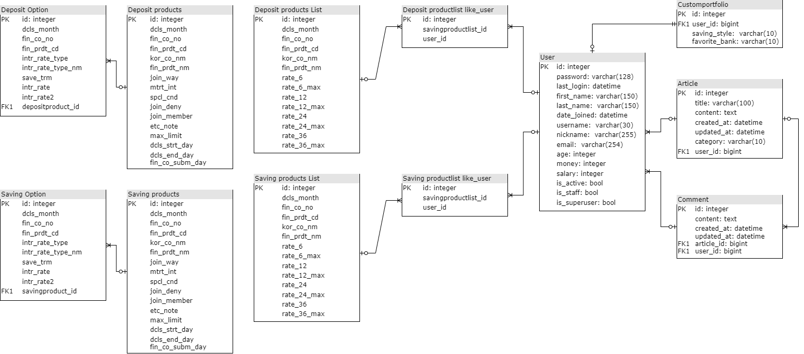
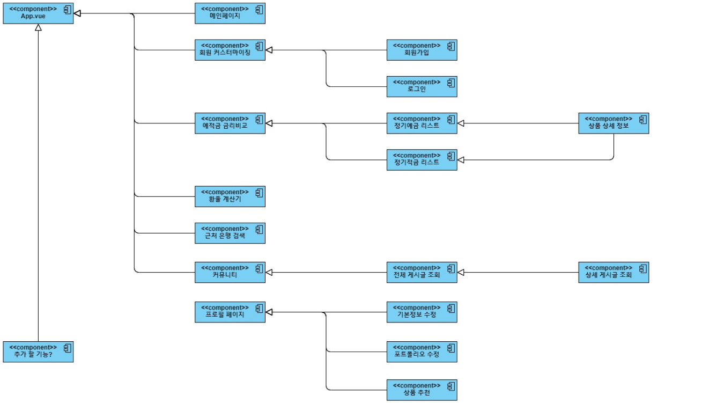

# 요약

👩‍💻 <b>개발 기간</b> : 2023.11.16 ~ 2023.11.23

🛠️ <b>프로젝트명</b> : BankSailor

- SSAFY 10기 1학기 관통 프로젝트 '금융 상품 비교 애플리케이션'

🖱️ 개발일정

11월 13일

- 팀명, 서비스명, 대표색상, 추천알고리즘 구상
- 필요 API 키 발급(금융감독원, 한국수출입은행, 카카오맵)

11월 14일

- 서비스명 'banksailor' 확정
- 대표 색상 위주로 피그마 작성

11월 15일

- 컴포넌트, view 구조 구상

11월 16일

- 금융비교, 환율, 카카오맵, 게시판 별로 역할 분담
- 17일까지 백엔드 완성 목표

11월 17일

- 금융 비교: 윤동휘
- 환율, 카카오맵: 김승희
- 게시판: 김현지

11월 18일~19일 주말

- 유저모델
- 프로필 페이지
- 앱 로고 제작

11월 20일

11월 21일

#### 👪 팀원

- 김승희 (팀장) - Back-End, Front-End
- 김현지 - Back-End, Front-End
- 윤동휘 - Back-End, Front-End

# 프로젝트 소개

## 서비스 소개

'BankSailor'

"당신만의 금융 항해사, BankSailor와 함께라면 저축이 더 쉬워집니다."

금전을 관리하는 여정은 넓은 바다를 항해하는 것과도 같습니다. BankSailor는 당신만의 안내자로서 여러분의 미래를 설계합니다. 함께 여행하며 안전한 항해를 경험해보세요.

## 주요 기능

- 예/적금별 금리 비교 제공

- 환율계산

- 주변 은행 검색

- 자유게시판

- 이용자 맞춤형 상품 추천 제공

# Technologies Used : 사용한 기술과 라이브러리

## 💻 기술 스택

[Frontend]

  

- 프레임워크 및 라이브러리

  - Vue Router (v4.2.5)
  - Pinia (v2.1.7) : 상태 관리 라이브러리입니다
  - Vue3 ApexCharts : 차트 라이브러리

- UI 프레임워크 및 컴포넌트

  - Bootstrap Vue (v2.23.1)
  - Font Awesome (v6.4.2)
  - SweetAlert2 (v11.6.13)
  - Vue Spinner (v1.0.4)
  - Vue3 Carousel (v0.3.1)

- 폼 검증 및 데이터 처리

  - Vee-Validate (v4.11.8)

- 빌드 및 개발 도구
  - Vite (v4.4.11):

[Backend]

 

- TensorFlow와의 결합을 용이하게 하기 위하여 프레임워크로 Django를 채택

- API 인증 및 권한 관리
  - Django Rest Framework
  - dj-rest-auth
  - allauth
- 이메일 서비스
  - Django Email Backend

## ERD

## 컴포넌트 구조

# 관련 문서

- [발표 자료](./BankSailor.pdf)
